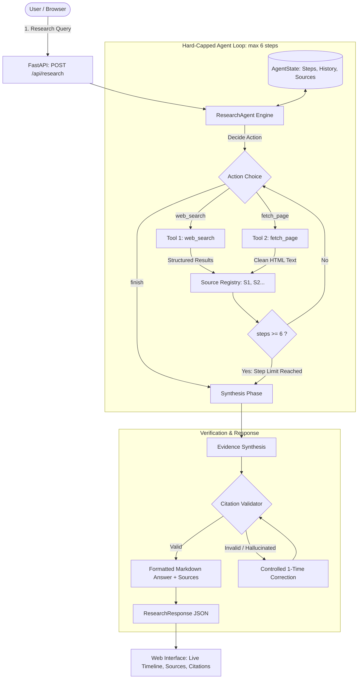

# Tool-Using Research Agent
### AgenticX AI Labs Internship — Project 1

An autonomous, explainable research agent that investigates complex user queries by dynamically planning tool calls, collecting real web evidence, enforcing strict step ceilings, and validating factual citations.

---

## 📋 Table of Contents
- [Project Overview & Internship Context](#-project-overview--internship-context)
- [AgenticX Assessment Criteria Mapping](#-agenticx-assessment-criteria-mapping)
- [System Architecture](#-system-architecture)
- [How the Agent Works](#-how-the-agent-works)
- [The Two Distinct Tools](#-the-two-distinct-tools)
- [Hard Step Limit Enforcement](#-hard-step-limit-enforcement)
- [Claim Traceability & Citation Validation](#-claim-traceability--citation-validation)
- [Graceful Failure Handling](#-graceful-failure-handling)
- [Technology Stack](#-technology-stack)
- [Project Structure](#-project-structure)
- [Setup & Installation](#-setup--installation)
- [Environment Configuration](#-environment-configuration)
- [Running the Application](#-running-the-application)
- [API Endpoints](#-api-endpoints)
- [Automated Testing](#-automated-testing)
- [Example Research Queries & Sample Output](#-example-research-queries--sample-output)
- [Internship Review & Video Demonstration Guide](#-internship-review--video-demonstration-guide)
- [Limitations & Future Roadmap](#-limitations--future-roadmap)

---

## 🎯 Project Overview & Internship Context

In **Project 1 of the AgenticX AI Labs Internship**, the core objective is to move beyond single-turn prompt-and-search wrappers (which are not true agents) and construct an **autonomous tool-using agent**.

The agent is presented with an open-ended research question such as:
> *"What are the main applications of generative AI in healthcare?"*

Rather than calling an API once and dumping the results into an LLM prompt, this agent:
1. Formulates search strategies and initiates targeted web searches.
2. Evaluates returned search snippets and chooses whether to fetch deep page content from specific discovered URLs.
3. Records all findings in a deterministic **Source Registry** with unique IDs (`S1`, `S2`, ...).
4. Strictly grounds every factual claim in the synthesized answer to a fetched source.
5. Runs an automated **Citation Validator** to reject hallucinated or unfetched source IDs.
6. Enforces a **hard limit of 6 steps** (`MAX_AGENT_STEPS = 6`) in code to eliminate infinite loops.
7. Handles network timeouts, 404s, missing API credentials, and empty results with zero application crashes.

---

## 🏆 AgenticX Assessment Criteria Mapping

This project is built directly against the four official AgenticX evaluation criteria:

| Criterion | Requirement | Implementation Detail | Location in Code |
| :--- | :--- | :--- | :--- |
| **1. Two Distinct Tools** | At least two distinct tools the agent can choose between dynamically. | `web_search` (Tavily search) and `fetch_page` (HTTP/BeautifulSoup parser). The agent reasons over evidence and chooses which tool to invoke. | [`app/tools/web_search.py`](app/tools/web_search.py)<br>[`app/tools/fetch_page.py`](app/tools/fetch_page.py)<br>[`app/agent/research_agent.py`](app/agent/research_agent.py#L90-L150) |
| **2. Hard Step Limit** | A hard step limit so the agent cannot loop indefinitely. | `MAX_AGENT_STEPS = 6` enforced at the Python code loop level. Halts loop and triggers synthesis if step 6 is reached. | [`app/config.py`](app/config.py#L22)<br>[`app/agent/research_agent.py`](app/agent/research_agent.py#L76-L160) |
| **3. Claim Traceability** | Every claim in final answer must be traceable to a fetched source. | Deterministic source registry (`S1`, `S2`), inline citations (`[S1]`), regex citation validator, rejection of phantom IDs (`[S99]`), and 1-time automated repair. | [`app/services/citation_validator.py`](app/services/citation_validator.py)<br>[`app/agent/state.py`](app/agent/state.py#L24-L65) |
| **4. Graceful Tool Failure** | Graceful handling when a tool fails or returns nothing. | Standardized `ToolResult` wrapper across all tools. Catches HTTP errors, 404s, missing keys, timeouts, and empty results without crashing. Returns honest fallback messages. | [`app/tools/base.py`](app/tools/base.py)<br>[`tests/test_failures.py`](tests/test_failures.py) |

---

## 🏗️ System Architecture



---

## 🔄 How the Agent Works

The agent loop executes with complete explainability:

1. **Initialization**: An isolated `AgentState` is created with `steps_used = 0` and `max_steps = 6`.
2. **Context Compilation**: At each step, the LLM receives:
   - The user's research question
   - Remaining step budget (`max_steps - steps_used`)
   - Complete tool history with success/failure summaries
   - List of currently registered sources (`S1`, `S2`...) with titles, URLs, and status
   - Recent errors encountered
3. **Autonomous Planning**: The LLM outputs a structured JSON action:
   - `web_search`: Search query string.
   - `fetch_page`: Discovered URL string for in-depth body text.
   - `finish`: Concludes research because sufficient evidence has been collected.
4. **Execution & Evidence Enrichment**:
   - The tool executes inside a `try/except` sandbox, returning a standardized `ToolResult`.
   - Discovered URLs are registered into the `SourceItem` registry. If a URL was already seen from search, calling `fetch_page` enriches the existing record without duplicating IDs.
5. **Loop Termination**:
   - The loop terminates if the agent selects `finish`, OR
   - When `steps_used == MAX_AGENT_STEPS` (hard ceiling).
6. **Strict Synthesis & Citation Validation**:
   - The LLM synthesizes an answer referencing exclusively the gathered `[S#]` tags.
   - `CitationValidator` scans the draft for all citation patterns.
   - If unknown source IDs (e.g. `[S99]`) or zero citations are detected, a controlled correction prompt is executed.
   - A standardized markdown `### Sources` section is appended.

---

## 🛠️ The Two Distinct Tools

### Tool 1: `web_search(query: str, max_results: int = 4)`
- **Purpose**: Discovers relevant pages across the web.
- **Provider**: Tavily Search API.
- **Output**: List of objects containing `title`, `url`, `domain`, and `snippet`.
- **Resilience**: Handles missing API keys, rate limits (HTTP 429), timeouts, and zero-result queries by returning `ToolResult(success=True, data=[])` or clean error strings without crashing.

### Tool 2: `fetch_page(url: str)`
- **Purpose**: Fetches the complete page body from a specific URL to retrieve in-depth evidence when search snippets are too brief.
- **Engine**: `httpx.Client` with realistic user-agent headers and `BeautifulSoup`.
- **Processing**:
  - Validates URL structure (`http://` or `https://`).
  - Strips non-content tags (`<script>`, `<style>`, `<nav>`, `<header>`, `<footer>`, `<aside>`).
  - Normalizes whitespace and extracts readable body paragraphs.
  - Truncates safely at 2,500 characters (`config.FETCH_PAGE_MAX_CHARS`) to protect token limits.
- **Resilience**: Catches HTTP 404, 403, SSL errors, connection failures, and non-HTML media types gracefully.

---

## ⏱️ Hard Step Limit Enforcement

To satisfy AgenticX Assessment Criterion 2, the step limit is enforced in Python code, not merely by prompting the LLM:

```python
# app/agent/research_agent.py
while state.steps_used < state.max_steps:
    state.steps_used += 1
    # LLM decision ...
    # Tool execution ...
    if state.steps_used >= state.max_steps:
        state.status = "step_limit_reached"
        break
```

- Configured globally via `MAX_AGENT_STEPS = 6` in `app/config.py`.
- Exposed in API responses (`steps_used`, `max_steps`) and UI step badges (`Step 4 / 6`).
- If an agent attempts to loop indefinitely (e.g., repeatedly calling `web_search`), the loop halts strictly at step 6 and synthesizes the best possible answer from evidence collected so far.

---

## 🔍 Claim Traceability & Citation Validation

1. **Source Registry**:
   Each source is registered in `AgentState` with a deterministic, incremental identifier (`S1`, `S2`, `S3`).
2. **Inline Citations**:
   The synthesis prompt enforces bracketed citations attached directly to factual assertions:
   > *"Generative AI assists radiologists by flagging anomalies in medical imaging [S1]. It also automates discharge summaries and clinical documentation [S2]."*
3. **Automated Citation Validator (`CitationValidator`)**:
   - Uses regex `\[(S\d+)\]` to extract all cited sources.
   - Verifies that every cited ID exists in `state.sources` and has `retrieval_status == "success"`.
   - Rejects hallucinated citations (such as citing `[S99]` when only `S1` and `S2` exist).
   - If invalid IDs are found, the agent runs one controlled correction prompt with the explicit error details.
   - Extracts a structured `claims_breakdown` mapping individual claims to their sources.
4. **Interactive UI Highlighting**:
   In the web interface, clicking or hovering any `[S1]` badge highlights the corresponding card in the Source Registry with smooth scrolling and an animated glow.

---

## 🛡️ Graceful Failure Handling

| Failure Mode | How It Is Handled | Result |
| :--- | :--- | :--- |
| **Missing API Key** | Detected before making external calls; logs warning. | Returns structured message explaining how to configure `.env`. No crash. |
| **Search API 429 / Rate Limit** | Caught in `web_search`; returns `ToolResult(success=False, error="Rate limit exceeded")`. | Agent logs error, records step, attempts alternative action. |
| **HTTP 404 / Broken Link** | Caught in `fetch_page`; returns `ToolResult(success=False, error="HTTP 404: Page not found")`. | Agent records failed URL, continues research using remaining sources. |
| **Empty Search Results** | Handled in `web_search`; returns `ToolResult(success=True, data=[], message="No results found")`. | Agent adapts, refines query, or finishes with available evidence. |
| **Network Timeout** | Catches `httpx.TimeoutException` after 12s timeout. | Clean error record in `state.errors`. System proceeds smoothly. |
| **Complete Research Failure** | If zero evidence could be fetched across all steps. | Returns honest message: *"I couldn't gather reliable web evidence for this question..."* **Never invents answers.** |

---

## 💻 Technology Stack

- **Language**: Python 3.11+ (Tested on Python 3.13.5)
- **Application Framework**: FastAPI
- **Server**: Uvicorn
- **LLM / Reasoning Layer**: OpenAI API (`openai>=1.10.0`, default model `gpt-4o-mini`)
- **Web Search**: Tavily Search API (`httpx` direct client & `tavily-python`)
- **Web Scraping & Parsing**: `httpx` & `beautifulsoup4`
- **Data Validation & Schemas**: Pydantic v2
- **Environment Management**: `python-dotenv`
- **Frontend**: Vanilla HTML5, CSS3 (Modern dark glassmorphism), Vanilla JavaScript
- **Test Suite**: `pytest` & `pytest-asyncio` with `unittest.mock`

---

## 📁 Project Structure

```
agenticx-research-agent/
│
├── app/
│   ├── __init__.py               # Application package definition
│   ├── config.py                 # Central config (MAX_AGENT_STEPS=6, models, API keys)
│   ├── main.py                   # FastAPI application, routing, and static mounting
│   │
│   ├── agent/
│   │   ├── __init__.py           # Agent exports (ResearchAgent, AgentState)
│   │   ├── research_agent.py     # Core agent loop, step counter, action dispatcher
│   │   ├── state.py              # AgentState, SourceItem, ToolCallRecord, Source Registry
│   │   └── prompts.py            # Decision, synthesis, and citation repair prompts
│   │
│   ├── tools/
│   │   ├── __init__.py           # Tool exports
│   │   ├── base.py               # Standardized ToolResult schema
│   │   ├── web_search.py         # Tool 1: Tavily Search with error handling
│   │   └── fetch_page.py         # Tool 2: Web page text extractor with BeautifulSoup
│   │
│   ├── models/
│   │   ├── __init__.py           # Schema exports
│   │   └── schemas.py            # Pydantic schemas (ResearchRequest, ResearchResponse, SourceItem)
│   │
│   └── services/
│       ├── __init__.py           # Service exports
│       └── citation_validator.py # Citation checking, regex verification, sources footer builder
│
├── templates/
│   └── index.html                # Modern, responsive research web interface
│
├── static/
│   ├── style.css                 # Dark glassmorphism styling, responsive layout, badges
│   └── app.js                    # Dynamic UI controller, interactive citations, audit viewer
│
├── tests/
│   ├── __init__.py               # Test package
│   ├── test_tools.py             # Tests for web_search and fetch_page (success & failure modes)
│   ├── test_agent.py             # Tests multi-tool workflow and REST endpoints
│   ├── test_step_limit.py        # Strict verification of MAX_AGENT_STEPS = 6 ceiling
│   ├── test_citations.py         # Citation extraction, validation, and ghost citation rejection
│   └── test_failures.py          # Resiliency against missing keys, 404s, timeouts, and outages
│
├── .env.example                  # Template environment variables file
├── .gitignore                    # Git ignore file protecting .env and cache
├── requirements.txt              # Pinned dependencies
├── README.md                     # Comprehensive project documentation
└── run.py                        # Entrypoint runner script
```

---

## 🚀 Setup & Installation

### 1. Clone or Open the Workspace
```bash
cd AgenticX-Research-Agent
```

### 2. Create and Activate a Virtual Environment (Optional but Recommended)
```bash
# On Windows (PowerShell):
python -m venv venv
.\venv\Scripts\Activate.ps1

# On macOS/Linux:
python3 -m venv venv
source venv/bin/activate
```

### 3. Install Dependencies
```bash
pip install -r requirements.txt
```

---

## ⚙️ Environment Configuration

Copy `.env.example` to create `.env`:

```bash
cp .env.example .env
```

Edit `.env` with your API keys:

```ini
# OpenAI API Configuration (Required for live agent reasoning)
OPENAI_API_KEY=sk-your-openai-api-key-here
OPENAI_MODEL=gpt-4o-mini

# Tavily API Configuration (Required for live web search)
TAVILY_API_KEY=tvly-your-tavily-api-key-here

# Hard Agent Step Limit (Cannot exceed 6 for AgenticX assessment)
MAX_AGENT_STEPS=6

# Server Host & Port
HOST=127.0.0.1
PORT=8000
```

> 🔒 **Security Notice**: `.env` is explicitly listed in `.gitignore` to guarantee API keys are never checked into version control.

---

## 🖥️ Running the Application

Start the server using `run.py`:

```bash
python run.py
```

Or using `uvicorn` directly:
```bash
python -m uvicorn app.main:app --host 127.0.0.1 --port 8000 --reload
```

Open your browser at:
👉 **[http://127.0.0.1:8000](http://127.0.0.1:8000)**

---

## 🔌 API Endpoints

### 1. Web UI
- `GET /`: Serves the research agent graphical interface.

### 2. Execute Research
- `POST /api/research`
- **Request Body**:
  ```json
  {
    "question": "What are the main applications of generative AI in healthcare?",
    "max_steps": 6
  }
  ```
- **Response**:
  ```json
  {
    "question": "What are the main applications of generative AI in healthcare?",
    "answer": "Generative AI transforms healthcare in clinical documentation [S1] and diagnostics [S2]...",
    "sources": [
      {
        "source_id": "S1",
        "title": "AI in Medicine",
        "url": "https://example.com/ai-med",
        "domain": "example.com",
        "snippet": "...",
        "tool": "web_search",
        "retrieval_status": "success"
      }
    ],
    "steps_used": 3,
    "max_steps": 6,
    "tool_history": [
      {
        "step": 1,
        "tool": "web_search",
        "input": {"query": "generative AI in healthcare"},
        "success": true,
        "summary": "Found 4 results"
      }
    ],
    "errors": [],
    "status": "completed"
  }
  ```

### 3. System Health
- `GET /health`
- Returns system status, step limit, model configuration, and API status.

### 4. Sample Queries
- `GET /api/example`
- Returns demonstration queries for evaluation.

---

## 🧪 Automated Testing

The automated test suite uses `pytest` with `unittest.mock` to verify the entire system offline without requiring live API keys or incurring costs:

```bash
python -m pytest -v
```

### Test Suite Breakdown (26 Tests Passing):
1. **`tests/test_tools.py`**:
   - `web_search`: Successful response, empty results, empty query rejection, missing key, network timeout.
   - `fetch_page`: HTML cleaning, tag removal, 404 response, invalid URL format, empty URL, connection timeout.
2. **`tests/test_step_limit.py`**:
   - Enforces `MAX_AGENT_STEPS = 6` default.
   - Simulates infinite-loop LLM; verifies agent strictly halts at 6 steps with status `step_limit_reached`.
   - Verifies custom step requests cannot exceed 6.
3. **`tests/test_citations.py`**:
   - Regex extraction of `[S#]` citations.
   - Validation passes on verified sources.
   - Rejects answers missing citations.
   - Rejects answers with hallucinated IDs (`[S99]`).
   - Rejects citations to sources whose retrieval failed.
   - Validates markdown sources footer builder and claims breakdown.
4. **`tests/test_failures.py`**:
   - Missing OpenAI key handling.
   - Complete tool outage: agent returns honest fallback message, never invents answers.
   - Broken URL on `fetch_page`: records failure and continues workflow.
5. **`tests/test_agent.py`**:
   - Full multi-tool workflow (`web_search` -> `fetch_page` -> `finish`).
   - REST endpoints: `/health`, `/api/example`, `/`.

---

## 💡 Example Research Queries & Sample Output

### Test Query 1:
> *"What are the main applications of generative AI in healthcare?"*

#### Sample Agent Execution Trace:
- **Step 1**: `web_search` → Query: *"generative AI applications in healthcare"*
  - Result: Discovered 4 articles (`S1`–`S4`).
- **Step 2**: `fetch_page` → URL: `https://www.healthaffairs.org/...`
  - Result: Extracted 2,410 characters of detailed medical workflows (`S2`).
- **Step 3**: `finish` → Reason: *"Sufficient evidence gathered across clinical documentation and diagnostics."*
- **Synthesis & Validation**: 100% of claims verified against `S1` and `S2`.

#### Sample Rendered Answer:
> Generative AI is being adopted across several healthcare domains, primarily in clinical documentation assistance and medical imaging analysis [S1]. Ambient clinical intelligence tools transcribe physician-patient dialogues into structured EHR notes, saving clinicians hours of administrative burden daily [S2]. Furthermore, machine learning models are being piloted to assist radiologists in preliminary anomaly detection [S1].
>
> ### Sources
> - **[S1]** [Generative AI in Clinical Practice](https://example.com/clinical-ai) — *example.com*
> - **[S2]** [Ambient Intelligence in Healthcare](https://example.com/ambient-ai) — *healthaffairs.org*

---

## 🎬 Internship Review & Video Demonstration Guide

When presenting this project for your AgenticX assessment or recording the walkthrough video, demonstrate the four criteria in this sequence:

1. **Demonstrate Dynamic Two-Tool Selection**:
   - Enter *"What are the main applications of generative AI in healthcare?"*.
   - Point out the **Agent Tool Activity** timeline showing that the agent chose `web_search` first, then inspected a specific result URL and chose `fetch_page` to read deeper evidence, rather than hardcoding tool calls.
2. **Demonstrate the Hard Step Limit**:
   - Point out the **Step Counter** badge (`Step X / 6`). Explain that `MAX_AGENT_STEPS = 6` is hard-coded into the agent loop in `app/agent/research_agent.py` so the agent can never enter an infinite loop.
3. **Demonstrate Claim Traceability**:
   - Highlight the bracketed citation tags (`[S1]`, `[S2]`) directly attached to factual assertions in the answer.
   - Hover over or click `[S1]` to show the interactive highlight linking directly to the registered source card in the **Source Registry** panel.
   - Explain how `app/services/citation_validator.py` validates citations and rejects hallucinated source IDs.
4. **Demonstrate Graceful Failure Handling**:
   - Demonstrate resilience by testing an obscure query or temporarily disconnecting keys.
   - Show that the application never throws an unhandled exception or 500 error; instead, it logs the event in `tool_history` and displays an honest explanation.
5. **Run the Automated Test Suite**:
   - In terminal, run `python -m pytest -v` to show all 26 automated tests passing.

---

## 🔭 Limitations & Future Roadmap

- **Browser Rendering**: `fetch_page` fetches raw HTML via `httpx`. Heavy client-side Single Page Apps (SPA) requiring JavaScript execution are not rendered (could integrate Playwright in future projects).
- **Multi-Query Synthesis**: Currently searches up to the step limit; future iterations can maintain a persistent vector memory across sessions.
- **Next Project Note**: Project 2 in the internship will implement multi-agent workflows using LangGraph.

---

## 📄 License & Academic Integrity

Built for the **AgenticX AI Labs Internship (Project 1: Tool-Using Research Agent)**.
All code is original, modular, clean, and thoroughly tested.
